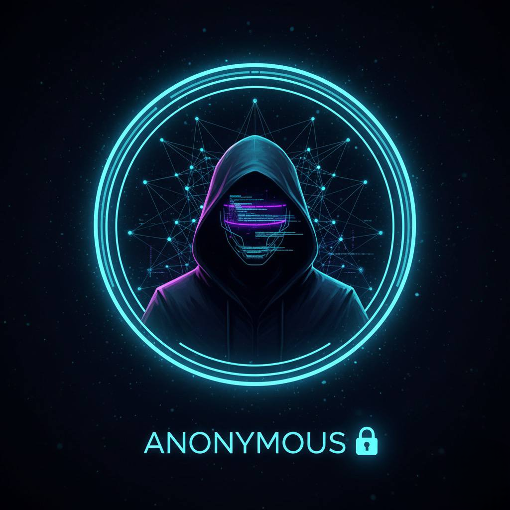

# ChatPeak — Анонимный чат в Telegram — приватность и единый поток общения 🚀

**ChatPeak** — не «анонимка на один вечер», а **платформа для комьюнити**: один общий поток, роли и модерация, достижения и резидентство, а для владельцев — **ферма** со своими ботами на той же технологии.

---

## ⚡ Quick Start

| | |

|---|---|

| **💬 Войти в чат** | [@ChatPeak_Bot](https://t.me/ChatPeak_Bot) → **/Start** |

| **🌾 Создать своего бота** | [@PeakFatherBot](https://t.me/PeakFatherBot) → конструктор фермы |

---

## Ключевые возможности

| | |

|---|---|

| 🧵 **Один поток** | Без комнат и веток — вся жизнь сообщества в одной ленте |

| 🎫 **CODE и ники** | Анонимность без привязки к профилю Telegram |

| 🛡️ **Роли и модерация** | Чистое общение без спама и 18+ по умолчанию в политике площадки |

| 🏆 **Достижения и резиденты** | Удержание и «ядро» комьюнити, не разовые знакомства |

| 🌾 **Ферма** | Свой бот, свои правила — тот же класс сценариев, что у основного бота |

| 🤖 **AI-помощник** | Поддержка беседы без раскрытия личностей участников |

| 🔔 **Бот уведомлений** | Ответы и активность не теряются в шуме Telegram |

⚙️ Набор функций в каждом боте настраивается владельцем площадки.

---

## Анонимный чат: суть в четырёх пунктах ✨

- **🧵 Одна лента** — как «большой стол»: виден весь поток, а не свалка из десятков веток.

- **🔒 Анонимность с CODE** — ник и короткий код в чате; личный профиль Telegram остаётся отдельно.

- **💭 Темы, о которых в офлайне стыдно** — обсудить с незнакомцами без давления «это навсегда привязано к тебе»; **без разврата и уклона в 18+** 🚫 — беседа и поддержка в рамках правил.

- **🎯 Свобода + рамки** — реакции и тёплые форматы ❤️‍🔥 плюс модерация, ЛС, скрытые и защищённые сообщения 🔐; ачивки 🏆, AI 🤖 и уведомления 🔔 удерживают в чате.

---

## Чем ChatPeak отличается от «обычных» анонимок

| | Знакомства «на вечер» | **ChatPeak** |

|---|---|---|

| Цель | Быстый матч, часто флирт | **Комьюнити** и долгие разговоры |

| Структура | Комнаты, рандом | **Единый поток** и общие правила |

| Удержание | Зашёл — ушёл | **Достижения**, **резидентство**, история в чате |

| Для владельцев | Нет «своей» площадки | **Ферма** — свой бот на платформе 🌾 |

**Киллер-фича:** не только чат для участников, а **экосистема** — статусы, игра, AI и возможность запустить **своего** бота без разработки с нуля.

---

## Скриншоты интерфейса

Визуально UX проще оценить, чем по тексту. Добавьте в репозиторий файлы в папку [`screenshots/`](screenshots/) (см. [что снять](screenshots/README.md)):

| Лента чата с **CODE** | Уведомления | AI-помощник |

|:---:|:---:|:---:|

|  |  |  |

*Пока скриншоты не загружены, изображения на GitHub могут не отображаться — замените файлы в `screenshots/`.*

---

## Для кого 👥

| Аудитория | Зачем |

|---|---|

| **👋 Новички** | Войти под случайным ником без давления «раскрыть профиль» |

| **💬 Постоянные** | Реакции, ачивки, ЛС и особые типы сообщений |

| **⭐ Резиденты** | Статус «ядра», заметное присутствие, персональные сценарии |

| **🌾 Владельцы** | Свой бот на ферме под своё комьюнити и правила |

---

## Новички и резиденты 🌱

**👋 Новички** — мягкий вход: ник «как получилось», присмотреться к тону, потом ЛС и сложные сценарии; меньше навязчивых контактов в первый день.

**⭐ Резиденты** — основа: заметное место в списке, персональные тексты, акцентные уведомления о входе/выходе 🏠.

---

## Технологии и надёжность

Без раскрытия внутренней архитектуры — то, что важно на GitHub:

| | |

|---|---|

| **⚙️ Нагрузка** | Асинхронная обработка сообщений, устойчивость к пикам активности в чате; платформа рассчитана на **живые комьюнити**, а не на единичные запросы |

| **🤖 AI** | Помощник на **современных LLM** (в т.ч. модели семейств **GPT** и **Claude** через провайдеров вроде OpenRouter; поддержка **Gemini** — в зависимости от конфигурации площадки) |

| **🔐 Данные** | Переписка и настройки чата обрабатываются в рамках сервиса; **не продаём** данные участников третьим лицам для рекламы |

| **🛡️ Приватность** | Анонимность в ленте — на уровне продукта (ник/CODE ≠ профиль Telegram); владелец бота задаёт политику модерации |

*Точные модели AI и лимиты зависят от настроек конкретного бота.*

---

## FAQ

**Это сервис знакомств?**  

Нет. ChatPeak — **платформа для комьюнити** и долгих анонимных бесед, не «анонимка на одну ночь».

**Нужен ли свой сервер?**  

Участникам — только Telegram. Владельцам своего бота — конструктор [@PeakFatherBot](https://t.me/PeakFatherBot).

**Можно ли отключить AI или уведомления?**  

Да, набор функций настраивается на уровне площадки/бота.

**Где исходный код?**  

Продуктовый код закрыт; этот репозиторий — **промо и описание** для пользователей и партнёров.

**Куда писать по ферме и сотрудничеству?**  

Контакты — в **описании профиля** [Peak Father](https://t.me/PeakFatherBot) в Telegram.

---

## Ферма: своя площадка 🌾

**Ферма** — свой анонимный чат-бот: отдельное имя в Telegram, свои участники и правила, **та же логика сценариев**, что у ChatPeak. Подходит клубам, фан-сообществам, учебным группам и закрытым кругам.

**Конструктор:** [**Peak Father**](https://t.me/PeakFatherBot) 🏠 — пошаговое создание бота.

**Платформа даёт:**

- 🤖 Свою «витрину» и вход по `/start`

- ⚡ Роли, модерацию, ЛС, скрытые форматы, реакции, ачивки, опросы, AI, бот уведомлений — по настройке

- 📚 Несколько ботов под разные темы или языки

- ✨ Единый привычный UX для вашей аудитории

🔒 Исходный код в этом репозитории **не публикуется** — только описание продукта.

### Боли владельцев — и как ChatPeak отвечает

- **«Чат превратился в свалку из 100 веток?»** → Перейдите на **единый поток** ChatPeak: одна лента, один ритм, меньше потерянных тем.

- **«Устали от спама и 18+ в анонимках?»** → **Роли и модерация** заточены под **чистое общение**; политика площадки — без развратного контента.

- **«Боитесь деанонимизации?»** → **Архитектурно разделены** чат (ник + CODE) и личный профиль Telegram; AI и модерация не подменяют «настоящую» личность участника в публичной ленте.

---

## Roadmap 🗺️

Проект в активной разработке. Ориентиры (без жёстких сроков):

- 🔌 Интеграция с **новыми LLM** и гибче настройка AI под тип сообщества

- 📊 **Расширенная аналитика** для владельцев ботов на ферме

- 🎨 **Кастомные темы** оформления и витрины бота

- 🤝 Инструменты для **партнёров и интеграторов** (обратная связь через Peak Father)

Идеи и запросы от GitHub-сообщества приветствуются через [@FeedPeak_Bot](https://t.me/FeedPeak_Bot).

---

## Анонимность в Telegram — и наш чат

В обычном мессенджере каждое слово видят те, кто знает вас в жизни. **ChatPeak** — другой формат: **общий поток**, **ник** и **CODE** вместо профиля из контактов, **правила** и **модерация** вместо хаоса, **беседа и поддержка** без уклона в разврат и **18+**.

Если вам откликается такая анонимность — **заходите в наш чат:**

### 👉 [@ChatPeak_Bot](https://t.me/ChatPeak_Bot) — нажмите **Start**

💡 *ChatPeak — живое, но управляемое анонимное общение в Telegram. Точный набор функций зависит от конфигурации конкретного бота и политики владельца чата.*

